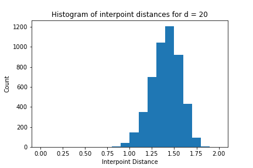
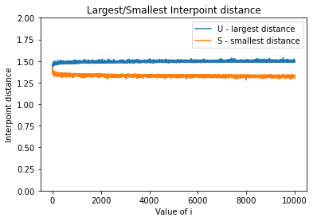

# Distance-Concentration

Experiments with distance concentration in high dimensions : High-dimensional spaces are full of strange effects. One of these is distance concentration, which is explored in this example.

Suppose n points x1, . . . , xn are drawn uniformly at random from the unit sphere in d dimensions, that is, $S^{d−1} = \\{ x \in \mathbb{R}^d : ||x||_2 = 1 \\}$ (the superscript is d − 1 because this is a (d − 1)-dimensional manifold in $\mathbb{R}^d$). When d is small, say 1 or 2 or 3, the distances between the points will take on a fairly broad range of values in [0, 2]. But as d grows, the interpoint distances get more concentrated. 

First off, how does one generate a random point $X \in S^{d−1}$? Here’s an easy way to do it:

<ul>
  <li>Let $Z_1, \ldots, Z_d$ each be chosen from a standard normal distribution (a Gaussian with mean zero and variance 1).</li>
  <li>Define Z = ($Z_1, \ldots, Z_d$) and X = $\frac{Z}{||Z||}$.</li>
</ul>

Using the procedure above, 100 samples were generated with d = 2, 5, 10, 20, 100, and all the $100 \choose 2$ interpoint distances were computed. Histogram plots of these interpoint distances, for each choice of d, are shown below.

From the plots above it can be observed that the distances concentrate around a particular value $v \in [0, 2]$ as d grows.

Now let's focus on a particular choice of d, say d = 1000, and try out the following procedure

<ul>
  <li>Pick $x^{(1)}$ at random from $S^{d−1}$</li>
  <li>For i = 2, 3, 4, . . . , 10000:
    <ul>
      <li>Generate $x^{(i)}$ at random from $S^{d−1}$</li>
      <li>Compute distances from $x^{(i)}$ to $x^{(1)}, \ldots, x^{(d−1)}$. Let $u_i$ be the largest of these distances and $s_i$ the smallest distance.</li>
    </ul>
  </li>
</ul>

The following plot shows both $u_i$ and $s_i$ values for i $>$ 1

The plot above illustrates that in $R^d$, there can be at most d + 1 points that are exactly the same distance from each other. But there can be $2^{O(d)}$ points that are approximately the same distance from each other.
